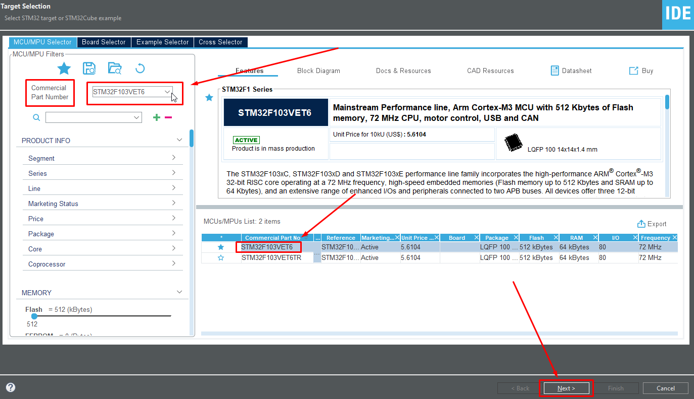
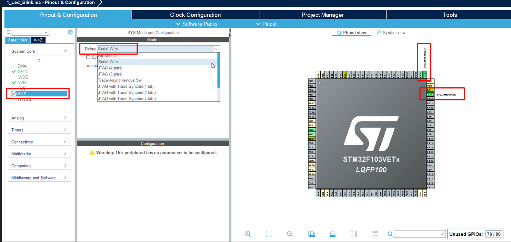
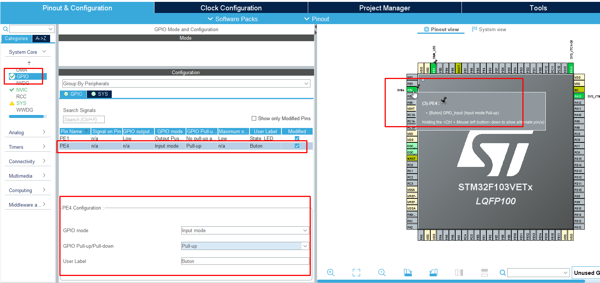
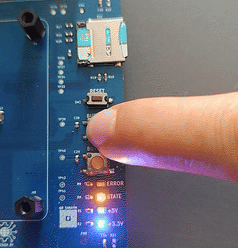

# 2. Buton Kontrolü (Giriş Okuma)

Bu uygulama, **PE4** pinine bağlı butonu okuyarak kullanıcı girişini nasıl algılayacağınızı gösterir. Butona basıldığında **PE1** pinindeki State LED yanacak, bırakıldığında sönecektir.

---

## 🚀 Adım 1: Yeni Proje Oluşturma Rehberi

Eytronix Geliştirme Kiti ile sıfırdan proje oluşturmak için aşağıdaki standart adımları takip edin:

### 1. Proje Sihirbazını Başlatma
1.  **STM32CubeIDE** programını açın.
2.  Sol üst menüden **File > New > STM32 Project** seçeneğine tıklayın.

<p align="center"></p>

### 2. İşlemci Seçimi (Target Selection)
Açılan pencerede:
* **Part Number Search** kutusuna işlemcimizin modelini yazın: `STM32F103VET6`
* Sağ alttaki listeden işlemciyi seçin ve **Next** butonuna basın.

<p align="center"></p>


### 3. Proje Yapılandırması
* **Project Name:** `2_Button_Control`
* **Targeted Language:** `C`
* **Targeted Binary Type:** `Executable`
* **Finish** butonuna basın.

> **Önemli Not:** "Initialize all peripherals with their default Mode?" uyarısı gelirse **No (Hayır)** diyerek temiz bir başlangıç yapın.

<br>

<p align="center"></p>

<br>
<br>

---

## ⚙️ Adım 2: Bu Proje İçin Özel Ayarlar (CubeMX)

Projenizi oluşturduktan sonra açılan **.ioc** arayüzünde şu ayarları yapın:

1.  **Debug Ayarı:** Sol menüden **System Core > SYS** -> **Debug:** `Serial Wire`.

<p align="center"></p>

2.  **LED Ayarı (Çıktı Görmek İçin):** **PE1** pinini seçin ve **GPIO_Output** yapın.

<p align="center"></p>

3.  **Buton Ayarı (PE4):** Sağ taraftaki işlemci görselinden **PE4** pinini bulun. Üzerine sol tıklayın ve **GPIO_Input** seçeneğini işaretleyin.

<p align="center"></p>

**4. Detaylı Pin Konfigürasyonu (PE4):**
Sol menüden **System Core > GPIO** sekmesine gelin, listeden **PE4** pinini seçin ve aşağıdaki **kritik** ayarları yapın:

| Ayar (Setting) | Seçilecek Değer | Açıklama |
| :--- | :--- | :--- |
| **GPIO Mode** | `Input mode` | Pini giriş moduna alır. |
| **GPIO Pull-up/Pull-down** | **`Pull-up`** | **(Zorunlu)** Pini varsayılan olarak 3.3V seviyesinde tutar. |
| **User Label** | `Buton` | Kod içerisinde okunabilirliği artırır. |

<br> 

State LED için **PE1** ayarlaması
<p align="center"></p>

Buton için **PE4** ayarlaması
<br>
<p align="center"></p>

*Ayarlar bittikten sonra üst menüden **Project > Generate Code** diyerek kodları oluşturun.*

<p align="center"></p>
<br>

---

## 💻 Adım 3: Yazılım (main.c)

Kodlar oluşturulduktan sonra `Core/Src/main.c` dosyasını açın.

⚠️ **ÖNEMLİ UYARI:** Kodlarınızın CubeMX güncellemesinde silinmemesi için **mutlaka** `USER CODE BEGIN 3` ile `USER CODE END 3` arasına yazmalısınız.

`while(1)` döngüsünün içini aşağıdaki gibi düzenleyin:

```c
  /* Infinite loop */
  while (1)
  {
    /* USER CODE END WHILE */

    /* USER CODE BEGIN 3 */

    
    if (HAL_GPIO_ReadPin(GPIOE, GPIO_PIN_4) == GPIO_PIN_RESET) //Buton Durumunu Oku (Pull-Up Mantığı)
    {
        //Durum: Butona BASILDI (Pin GND'ye çekildi -> 0V okundu) */
        HAL_GPIO_WritePin(GPIOE, GPIO_PIN_1, GPIO_PIN_SET); // LED'i Yak
    }
    else
    {
        /* Durum: Buton BIRAKILDI (Dahili Direnç Pini 3.3V'a çekti -> 1 okundu) */
        HAL_GPIO_WritePin(GPIOE, GPIO_PIN_1, GPIO_PIN_RESET); // LED'i Söndür
    }

    /* USER CODE END 3 */
  }
```

  ## Kodun ve Donanımın Mantığı (Neden Pull-Up?)

Yeni başlayanlar için "Butona basınca neden `0` (RESET) okuyoruz?" sorusu kafa karıştırıcı olabilir. İşte bu projedeki elektronik mantık:

### 1. Donanım Yapısı
Geliştirme kiti üzerinde butonun bir ucu **İşlemci Pinine (PE4)**, diğer ucu ise **GND (Şase/0V)** hattına bağlıdır.

### 2. Dahili Pull-Up Direncinin Görevi
CubeMX üzerinden `Pull-up` ayarını seçtiğimizde, STM32'nin içinde pini **3.3V** hattına bağlayan hayali bir direnç aktif olur. 

* **Butona Basılmadığında:** Pin boştadır. Dahili direnç sayesinde pin sürekli **3.3V (Lojik 1 / SET)** seviyesinde tutulur. Bu, "hayalet basışları" ve parazitleri engeller.
* **Butona Basıldığında:** Pin doğrudan **GND**'ye bağlanır. Elektrik en dirençsiz yolu seçtiği için pinin voltajı anında **0V (Lojik 0 / RESET)** olur.


### 3. Yazılımdaki Karşılığı
Bu tasarım "Active Low" (Düşükte Aktif) olarak adlandırılır. Bu yüzden kodumuzda butonun basılma anını şu şekilde yakalarız:

```c
// Eğer okunan değer 0 ise (RESET), buton fiziksel olarak basılmıştır.
if (HAL_GPIO_ReadPin(GPIOE, GPIO_PIN_4) == GPIO_PIN_RESET) 
{
    // Aksiyon al (Örn: LED'i Yak)
}
```

## 📺 Sonuç (Demo)

Kod karta yüklendikten sonra **PE4** pinine bağlı butonun ve **PE1** pinine bağlı LED'in çalışma durumu aşağıdaki gibidir:

<p align="center"></p>
