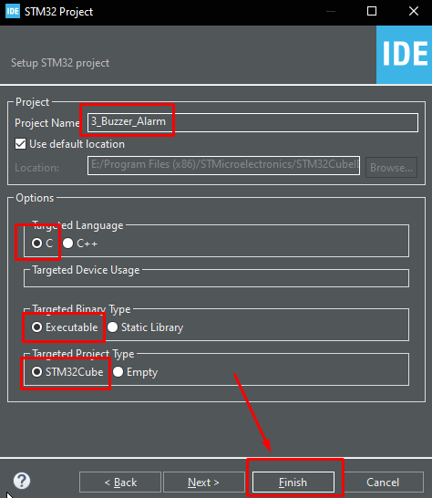
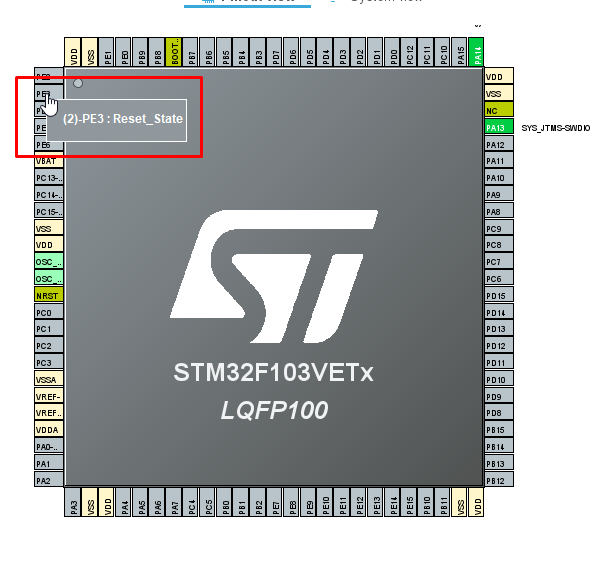
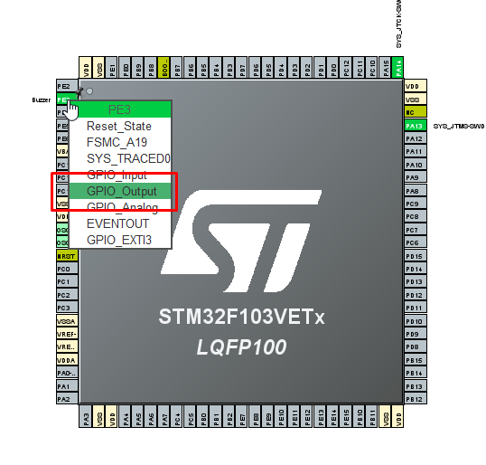
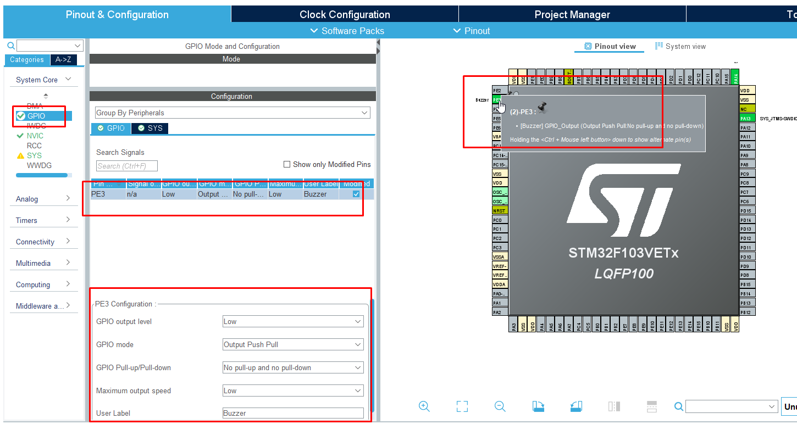

# 3. Buzzer Alarm (Ses Kontrolü)

Bu uygulama, **PE3** pinine bağlı olan Buzzer'ı kullanarak sesli uyarı (bip sesi) oluşturur. Donanım üzerindeki sesli geri bildirim mekanizmasını test etmek için kullanılır.

---

## 🚀 Adım 1: Yeni Proje Oluşturma Rehberi

Eytronix Geliştirme Kiti ile sıfırdan proje oluşturmak için aşağıdaki standart adımları takip edin:

### 1. Proje Sihirbazını Başlatma
1.  **STM32CubeIDE** programını açın.
2.  Sol üst menüden **File > New > STM32 Project** seçeneğine tıklayın.

<p align="center"></p>

### 2. İşlemci Seçimi (Target Selection)
Açılan pencerede:
* **Part Number Search** kutusuna işlemcimizin modelini yazın: `STM32F103VET6`
* Sağ alttaki listeden işlemciyi seçin ve **Next** butonuna basın.

<p align="center"></p>

### 3. Proje Yapılandırması
* **Project Name:** `3_Buzzer_Alarm`
* **Targeted Language:** `C`
* **Targeted Binary Type:** `Executable`
* **Finish** butonuna basın.

> **Önemli Not:** "Initialize all peripherals with their default Mode?" uyarısı gelirse **No (Hayır)** diyerek temiz bir başlangıç yapın.


<p align="center"></p>


## ⚙️ Adım 2: Bu Proje İçin Özel Ayarlar (CubeMX)

Projenizi oluşturduktan sonra açılan **.ioc** arayüzünde şu ayarları yapın:

1.  **Debug Ayarı:** Sol menüden **System Core > SYS** kategorisine tıklayın ve **Debug** seçeneğini `Serial Wire` yapın.

<p align="center"></p>

2.  **Pin Seçimi:** Sağ taraftaki işlemci görselinden **PE3** pinini bulun.

<p align="center"></p>

3.  **Pin Modu:** Pinin üzerine sol tıklayın ve **GPIO_Output** seçeneğini işaretleyin.

<p align="center"></p>

<br>

**4. Detaylı Pin Konfigürasyonu:**
Sol menüden **System Core > GPIO** sekmesine gelin, listeden **PE3** pinini seçin ve aşağıdaki ayarları yapın:

| Ayar (Setting) | Seçilecek Değer |
| :--- | :--- |
| **GPIO Output Level** | `Low` |
| **GPIO Mode** | `Output Push Pull` |
| **GPIO Pull-up/Pull-down** | `No pull-up and no pull-down` |
| **Maximum Output Speed** | `Low` |
| **User Label** | `Buzzer` |

<p align="center"></p>


*Ayarlar bittikten sonra üst menüden **Project > Generate Code** diyerek kodları oluşturun.*


<p align="center"></p>


## 💻 Adım 3: Yazılım (main.c)

Kodlar oluşturulduktan sonra `Core/Src/main.c` dosyasını açın.

⚠️ **ÖNEMLİ UYARI:** Kodlarınızın CubeMX güncellemesinde silinmemesi için **mutlaka** `USER CODE BEGIN 3` ile `USER CODE END 3` arasına yazmalısınız.

`while(1)` döngüsünün içini aşağıdaki gibi düzenleyin:

```c
  /* Infinite loop */
  while (1)
  {
    /* USER CODE END WHILE */

    /* USER CODE BEGIN 3 */

    HAL_GPIO_WritePin(GPIOE, GPIO_PIN_3, GPIO_PIN_SET); //Buzzer'ı Aktif Et (Ses Ver)
    HAL_Delay(200); // 200ms boyunca ötsün
    
    HAL_GPIO_WritePin(GPIOE, GPIO_PIN_3, GPIO_PIN_RESET); //Buzzer'ı Pasif Et (Sustur)
    HAL_Delay(1000); // 1 saniye sessiz kalsın
    
    /* USER CODE END 3 */
  }
```

<br>

## 📺 Sonuç (Demo)

Kod karta yüklendikten sonra **PE4** pinine bağlı buzzer aktif ve pasif olarak sesli bir uyarı verecektir.Videoyu izlemek için linke tıklayın.


  <p align="center">
  https://github.com/user-attachments/assets/09130f72-8a7f-4b38-ba5e-6dfd2a9bb148
  <br>
  <i>Video: Buzzer sesi uyarısı.</i>
</p>
