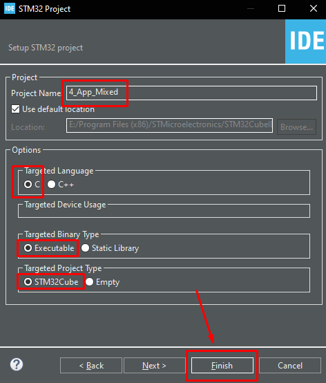

# 4. Karma Uygulama (Alarm Sistemi Simülasyonu)

Bu uygulama; **Buton (Giriş)**, **LED (Görsel Çıkış)** ve **Buzzer (Sesli Çıkış)** birimlerini bir arada kullanır. Butona basıldığı sürece sistem alarm verir (Işık yanar ve ses çıkar), buton bırakıldığında her iki çıktı da susar.

---

## 🚀 Adım 1: Yeni Proje Oluşturma Rehberi

Geliştirme Kiti ile sıfırdan proje oluşturmak için aşağıdaki standart adımları takip edin:

### 1. Proje Sihirbazını Başlatma
1.  **STM32CubeIDE** programını açın.
2.  Sol üst menüden **File > New > STM32 Project** seçeneğine tıklayın.

<p align="center"></p>

<br>
 
### 2. İşlemci Seçimi (Target Selection)
Açılan pencerede:
* **Part Number Search** kutusuna işlemcimizin modelini yazın: `STM32F103VET6`
* Sağ alttaki listeden işlemciyi seçin ve **Next** butonuna basın.

<p align="center"></p>


<br>

### 3. Proje Yapılandırması
* **Project Name:** `4_App_Mixed`
* **Targeted Language:** `C`
* **Targeted Binary Type:** `Executable`
* **Finish** butonuna basın.

> **Önemli Not:** "Initialize all peripherals with their default Mode?" uyarısı gelirse **No (Hayır)** diyerek temiz bir başlangıç yapın.

<p align="center"></p>

<br>

---

## ⚙️ Adım 2: Bu Proje İçin Özel Ayarlar (CubeMX)

Projenizi oluşturduktan sonra açılan **.ioc** arayüzünde şu ayarları yapın:

1.  **Debug Ayarı:** Sol menüden **System Core > SYS** kategorisine tıklayın ve **Debug** seçeneğini `Serial Wire` yapın.

<p align="center"></p>


### 2. GPIO Ayarları (Tabloya Göre Yapın)

| Bileşen | Pin | Mod | Pull Ayarı | User Label |
| :--- | :--- | :--- | :--- | :--- |
| **State LED** | `PE1` | GPIO_Output | No Pull | `State_LED` |
| **Buzzer** | `PE3` | GPIO_Output | No Pull | `Buzzer` |
| **Buton** | `PE4` | **GPIO_Input** | **Pull-up** | `Buton` |

> **Hatırlatma:** Pinlerin üzerine sağ tıklayarak "Enter User Label" kısmından isimlerini verirseniz kod yazarken kolaylık sağlar.

*Ayarlar bittikten sonra **Project > Generate Code** (Ctrl+S) diyerek kodları oluşturun.*

<p align="center"></p>

---

## 💻 Adım 3: Yazılım (main.c)

Projenin ana mantığı; butonun durumunu kontrol etmek ve her iki çıkış birimini (LED ve Buzzer) aynı anda yönetmektir.

`while(1)` döngüsü içindeki `USER CODE BEGIN 3` alanına aşağıdaki kodu ekleyin:

```c
  /* Infinite loop */
  while (1)
  {
    /* USER CODE END WHILE */

    /* USER CODE BEGIN 3 */

    /* Buton Durumunu Kontrol Et (Active Low - Basınca 0 olur) */
    if (HAL_GPIO_ReadPin(GPIOE, GPIO_PIN_4) == GPIO_PIN_RESET)
    {
        /* Butona Basıldı: ALARM AKTİF! */
        HAL_GPIO_WritePin(GPIOE, GPIO_PIN_1, GPIO_PIN_SET);   // LED'i yak
        HAL_GPIO_WritePin(GPIOE, GPIO_PIN_3, GPIO_PIN_SET);   // Buzzer'ı öttür
        HAL_Delay(250); // 250ms bekle
    }
    else
    {
        /* Buton Bırakıldı: SİSTEM SESSİZ */
        HAL_GPIO_WritePin(GPIOE, GPIO_PIN_1, GPIO_PIN_RESET); // LED'i söndür
        HAL_GPIO_WritePin(GPIOE, GPIO_PIN_3, GPIO_PIN_RESET); // Buzzer'ı sustur
        HAL_Delay(250); // 250ms bekle
    }

    /* USER CODE END 3 */
  }
```
## 📺 Sonuç (Demo)

Kod karta yüklendikten sonra **PE1** pinine bağlı LED'in ve **PE3** pinine bağlı **Buzzer** ile **PE4** pinine bağlı Butona basınca **LED**'i ve **Buzzer** aktif eden bırakınca pasif eden bir çalışma durumu aşağıdaki gibidir:

<br>
<p align="center">
https://github.com/user-attachments/assets/e3dd36a2-b015-4f25-ae75-66fcd2238aae
  <br>
  <i>Video: Buton basınca sesli ve görüntü uyarısı.</i>
</p>
